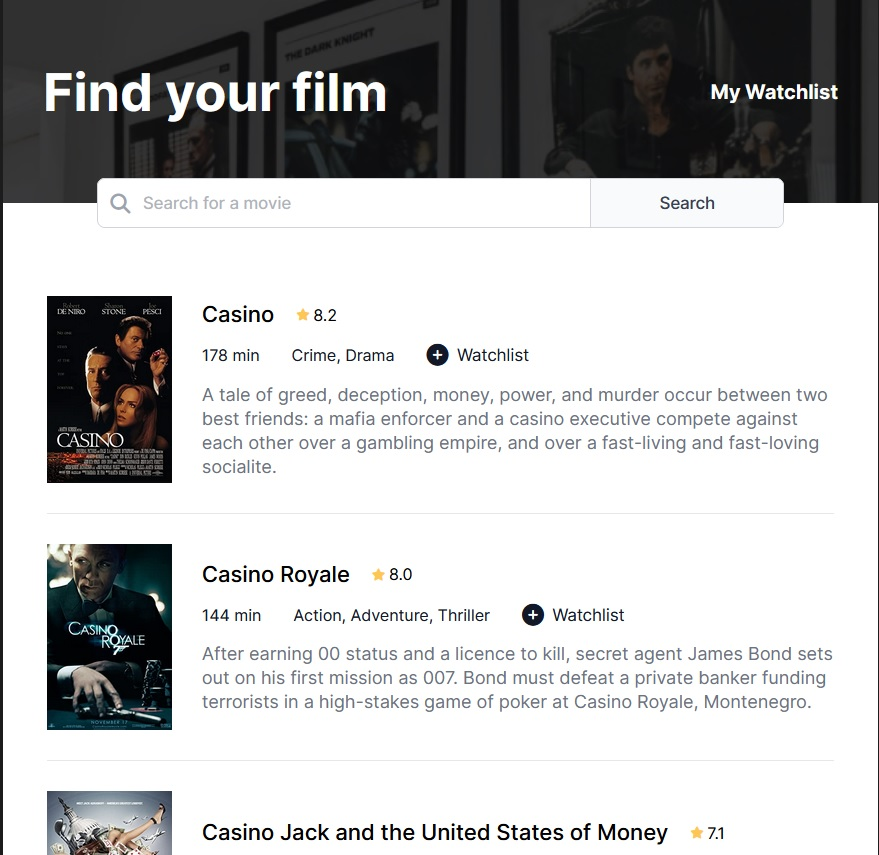

# Moviography

The app allows user to search for films and add them to watchlist.

## Table of contents

- [Overview](#overview)
  - [Features](#features)
  - [Screenshot](#screenshot)
  - [Links](#links)
- [My process](#my-process)
  - [Built with](#built-with)
  - [What I learned](#what-i-learned)
  - [Continued development](#continued-development)
- [Author](#author)
- [Acknowledgments](#acknowledgments)


## Overview

### Features


- Search for films pulls data from API and renders the results
- Film repetitions are removed
- Films are displayed in order from highest to lowest rating
- User can switch between film search and watchlist view (top-right corner)
- User is able to add and remove films to/from the watchlist
- Films in watchlist are saved to local storage


### Screenshot




### Links

- Code: [Github](https://github.com/Arniss5/Moviography)
- Live Site URL: [Github Pages](https://arniss5.github.io/Moviography/)

## My process

### Built with

- HTML5
- CSS
- JavaScript
- API


### What I learned

With this project I practised pulling data from API. I also got more experience manipulating DOM and inbuilt JS functions (splice, indexof, forEach). I practised saving data in local storage and importing/exporting modules.

```js
document.addEventListener("click", e => {
    if (e.target.className.includes("watchlist-toggle")) {
        const filmToRemove = watchlist.filter(film => film.imdbID == e.target.dataset.film)[0]
        watchlist.splice(watchlist.indexOf(filmToRemove), 1)
        localStorage.setItem("watchlist", JSON.stringify(watchlist))
        renderWatchlist()
    }
})
```
```js
import { getFilmsHtml } from "./utils.js"
```
```js
fetch(`https://www.omdbapi.com/?apikey=cec89db4&s=${searchBar.value}`)
        .then(res => res.json())
        .then(data => {
            //fetch detailed info about each film
            if (data.Search) {
                data.Search.forEach(film => {
                    fetch(`https://www.omdbapi.com/?apikey=cec89db4&t=${film.Title}`)
                    .then(res => res.json())
                    .then(data => {
                        
                        //fix API bug and exclude repetition films
                        if (!filmsArray.find(film => film.Plot === data.Plot)) {
                            filmsArray.push(data)
                          }
                        
                        //sort films from highest rating
                        filmsArray.sort((a, b) => {
                            return b.imdbRating - a.imdbRating;
                        })
    
                        document.getElementById('card-container').innerHTML = getFilmsHtml(filmsArray, "", "hidden")
                    })
                })
```


### Continued development

I'm planning on learning more about UI Design and starting learning React framework.

## Author

- Github - [Arniss5](https://github.com/Arniss5)


## Acknowledgments

[Movie API](https://www.omdbapi.com/)

